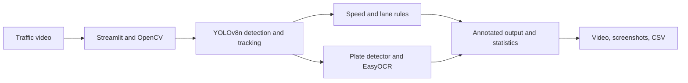

# AI-Based Traffic Violation Detection

[](https://www.python.org/)
[](https://streamlit.io/)
[](https://docs.ultralytics.com/)
[](https://github.com/Alif1642/ai-traffic-violation-detection/actions/workflows/ci.yml)
[](LICENSE)

A Streamlit and computer-vision research prototype for detecting and tracking road vehicles, estimating rule-based speed/lane violations, and attempting license-plate recognition from uploaded traffic videos.

> **Research-use notice:** Speed is estimated from uncalibrated pixel displacement, and lane status is based on simple frame-position rules. This project is not suitable for automated enforcement or safety-critical decisions.

## Demo

No verified public live deployment was included with the project. Run the Streamlit application locally:

```bash
streamlit run app.py
```

The interface accepts traffic video, shows live vehicle counts and annotated frames, and provides downloadable detection results. A sample vehicle crop produced by the application is available in [`docs/screenshots`](docs/screenshots/).

## Project overview

Manual review of long CCTV recordings is slow and difficult to scale. This academic prototype explores a low-cost, video-based workflow that combines object detection, tracking, OCR, and transparent rules to summarize supported vehicles and possible violations.

The supplied implementation does **not** include an API, database, Docker setup, durable cloud storage, authentication, or production monitoring. Those capabilities are not claimed here.

## Objectives

- Detect supported vehicle classes in uploaded road video.
- Maintain track IDs across frames.
- estimate motion from successive vehicle positions;
- apply simple overspeed and lane-side rules;
- locate plate regions and attempt OCR;
- save annotated video, vehicle crops, statistics, and CSV results.

## Verified features

- Streamlit video upload for MP4, AVI, MOV, and MKV
- YOLOv8n detection for car, motorcycle, bus, and truck COCO classes
- Persistent Ultralytics tracking in the web application
- Approximate pixel-motion speed calculation
- Left/right frame-side assignment and a right-side bus/truck violation rule
- Custom YOLO plate-region detection and EasyOCR transcription
- Optional bounding boxes and optional output-video saving
- Live counts, progress, annotated preview, saved crops, and downloadable CSV
- Experimental notebook containing a separate DeepSORT/Canny/Hough workflow

## Architecture



See [Architecture](docs/architecture.md) for the detailed runtime flow and design limitations.

## Workflow

1. Upload an authorized road-traffic video.
2. Read frames and metadata with OpenCV.
3. Detect and track supported vehicles with YOLOv8n.
4. classify each vehicle into the left or right half of the frame;
5. estimate movement from consecutive centre points;
6. apply `Over Speed` and `Wrong Lane` rules;
7. detect plate regions and run OCR;
8. display and export the processed results.

## Technology stack

| Layer | Technology | Purpose |
|---|---|---|
| Interface | Streamlit | Upload, controls, live preview, metrics, downloads |
| Vision | Ultralytics YOLOv8n | Vehicle detection and tracking |
| Plate pipeline | Custom YOLO weights + EasyOCR | Plate localization and text extraction |
| Video | OpenCV | Frame decoding, annotation, image/video writing |
| Data | NumPy, Pandas | Motion calculation and tabular results |
| Experiments | Jupyter, DeepSORT, scikit-learn, XGBoost | Research notebook and offline comparisons |
| CI | GitHub Actions, pytest, Ruff | Static validation and repository tests |

## Dataset and preprocessing

The report describes road video collected with a smartphone and preprocessing that includes removing unsuitable clips, format conversion, resizing, frame extraction, noise reduction, and video combination. In the supplied notebook, one source video is resized to 1280x720 and processed with OpenCV, YOLO, DeepSORT, Canny edges, and Hough lines.

The original 565.7 MB video and 554.1 MB generated output are excluded from Git. See [Dataset notes](data/README.md).

## Detection and rule logic

The Streamlit application uses pretrained YOLOv8n weights for general vehicles and a supplied custom YOLO model for plate regions. EasyOCR reads cropped plate candidates.

The application does not contain a separately trained end-to-end violation classifier:

- `Over Speed` is assigned when the pixel-displacement-derived value exceeds 60.
- `Wrong Lane` is assigned to a detected bus or truck in the right half of the frame.
- if both conditions occur, the later lane rule replaces the speed label.

These values are heuristics and must be calibrated for a specific camera before physical interpretation.

## Evaluation and results

The research artifacts contain 464 logged rows (433 `Overspeed`, 31 `Lane Change`) and saved Random Forest, XGBoost, and SVM reports. The reported test split contains 93 rows; the saved reports show approximately 98.9% for Random Forest/SVM and 100% for XGBoost.

These metrics are preserved for transparency but are **not presented as independent validation results**. The notebook creates its ground-truth file from predictions, sometimes compares the same labels as `y_true` and `y_pred`, and uses a rule-defining `Speed` feature to predict the violation label. This introduces circular evaluation and target leakage. Read the [Project report and implementation review](docs/project-report-summary.md) before citing any result.

## Local installation

```bash
git clone https://github.com/Alif1642/ai-traffic-violation-detection.git
cd ai-traffic-violation-detection
python -m venv .venv
```

Windows PowerShell:

```powershell
Set-ExecutionPolicy -Scope Process -ExecutionPolicy Bypass
.\.venv\Scripts\Activate.ps1
python -m pip install --upgrade pip
pip install -r requirements.txt
```

Run the application:

```powershell
streamlit run app.py
```

Then open `http://localhost:8501`. Detailed instructions are in [Setup](docs/setup.md).

## Testing

```powershell
pip install -r requirements-dev.txt
python -m compileall -q app.py tests
ruff check app.py tests
pytest -q
```

The included tests validate Python syntax, required model files, and removal of the original machine-specific model path. They are repository smoke tests, not model-accuracy tests.

## Project structure

```text
ai-traffic-violation-detection/
├── .github/workflows/ci.yml
├── .streamlit/config.toml
├── data/README.md
├── docs/
│   ├── architecture.md
│   ├── deployment.md
│   ├── project-report-summary.md
│   ├── setup.md
│   └── screenshots/
├── evaluation/
│   ├── data/
│   ├── figures/
│   └── reports/
├── models/
│   ├── license_plate_detector.pt
│   ├── yolov8n.pt
│   └── README.md
├── notebooks/traffic_violation_experiments.ipynb
├── outputs/.gitkeep
├── screenshots/.gitkeep
├── tests/test_repository.py
├── uploads/.gitkeep
├── app.py
├── requirements.txt
├── requirements-dev.txt
├── .gitignore
├── LICENSE
└── README.md
```

## Deployment

The verified entry point is `app.py`. Streamlit Community Cloud can deploy the repository without secrets, but YOLO/EasyOCR processing and large videos may exceed hosted resource limits. No live deployment has been verified. See [Deployment notes](docs/deployment.md).

## Security, privacy, and responsible use

- Process only footage you are authorized to use.
- Do not publish identifiable people or license plates without a lawful basis.
- Treat OCR output as uncertain and require human review.
- Generated uploads, crops, and videos may contain personal data; define retention and deletion controls before shared deployment.
- Do not use heuristic violations as evidence without calibrated measurement and independent validation.
- No credentials or API keys are required by the current application.

## Limitations

- Pixel displacement is not calibrated km/h.
- Frame-half lane logic does not understand arbitrary road geometry.
- OCR is sensitive to blur, lighting, angle, resolution, and occlusion.
- Dense traffic can reduce detection and tracking quality.
- The custom plate model's training data/configuration is missing.
- The evaluation data is not an independent manually labelled benchmark.
- Processing is synchronous and local-file based.

## Future improvements

- Build a manually annotated, leakage-free video benchmark.
- Use camera calibration, perspective mapping, and measured distance for speed.
- Define camera-specific lane polygons or train a lane model.
- Evaluate detector mAP, tracking metrics, OCR accuracy, speed error, and violation precision/recall separately.
- Add asynchronous jobs, durable object storage, authentication, structured logs, and monitoring for production use.
- Add regional plate-format training and privacy-aware evidence retention.

## Author

**Md. Alif Hossen**  
B.Sc. in Computer Science & Engineering  
Daffodil International University

- GitHub: [Alif1642](https://github.com/Alif1642)
- LinkedIn: [md-alif-hossen1642](https://www.linkedin.com/in/md-alif-hossen1642/)

## License

This repository is available under the [MIT License](LICENSE). Confirm that you have redistribution rights for all datasets and model weights before public release.
