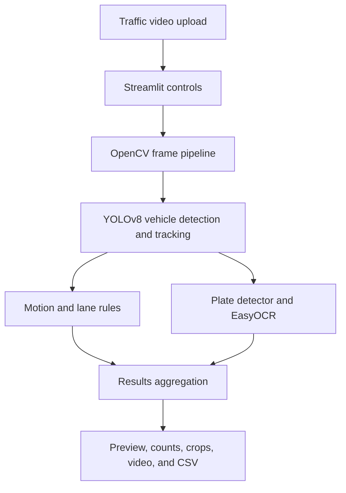
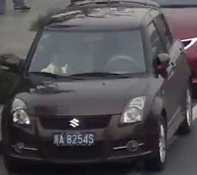

# AI-Based Real-Time Traffic Violation Detection System

<div align="center">

**A computer-vision research prototype for analysing road videos with vehicle detection, multi-object tracking, rule-based violation screening, and license-plate OCR.**

[](https://www.python.org/)
[](https://docs.ultralytics.com/)
[](https://streamlit.io/)
[](https://opencv.org/)
[](https://github.com/Alif1642/ai-traffic-violation-detection/actions/workflows/ci.yml)
[](LICENSE)

[](https://ai-traffic-violation-detection.streamlit.app/)

[Live Demo](#live-demo) · [Features](#key-features) · [Architecture](#system-architecture) · [Quick Start](#quick-start) · [Evaluation](#evaluation-and-results) · [Documentation](#documentation)

</div>

> [!IMPORTANT]
> This is an academic/research prototype, not an automated enforcement system. Its speed value is based on uncalibrated pixel displacement, while lane status is derived from simple frame-position rules. All flagged events require human review.

## At a glance

| Area | Implemented capability |
|---|---|
| Input | Uploaded MP4, AVI, MOV, or MKV traffic video |
| Detection | YOLOv8n detection of cars, motorcycles, buses, and trucks |
| Tracking | Persistent Ultralytics object tracking with unique track IDs |
| Plate pipeline | Custom YOLO plate-region detector followed by EasyOCR |
| Violation screening | Pixel-motion overspeed heuristic and right-side bus/truck rule |
| Interface | Streamlit dashboard with controls, preview, counts, and progress |
| Outputs | Annotated video, vehicle crops, summary statistics, and CSV download |
| Storage | Local filesystem only |

## Project overview

Manual review of long CCTV recordings is time-consuming, difficult to scale, and vulnerable to missed events. This project demonstrates how an accessible computer-vision pipeline can help an operator screen uploaded road footage, track supported vehicle classes, inspect possible speed or lane violations, and attempt number-plate transcription.

The repository represents a complete prototype with a Streamlit interface, two YOLO model weights, OCR integration, research artifacts, documentation, smoke tests, GitHub Actions validation, and a public Streamlit Community Cloud demo. It does **not** contain a REST API, database, Docker setup, authentication, durable cloud storage, or production monitoring; those capabilities are therefore not claimed.

## Live demo

The Streamlit interface is publicly accessible here:

### [Launch the Traffic Violation Detection App](https://ai-traffic-violation-detection.streamlit.app/)

The hosted demo runs the repository's `app.py` entry point. Upload a short, authorized traffic video to explore the implemented vehicle detection, tracking, rule-based screening, OCR attempt, annotated preview, and downloadable results. Because YOLO, EasyOCR, and video processing are resource intensive, initial startup and longer videos may take additional time on Community Cloud.

## Problem statement

Traffic surveillance can produce more video than a human team can review efficiently. A useful assistance system should locate relevant road objects, preserve their identity across frames, apply transparent event rules, and present evidence in a form that an operator can inspect. This prototype explores that workflow while keeping its assumptions and technical limitations visible.

## Key features

### Detection and tracking

- Detects the COCO vehicle classes `car`, `motorcycle`, `bus`, and `truck` using YOLOv8n.
- Uses `YOLO.track(..., persist=True)` to retain object identities between frames.
- Provides a configurable vehicle-detection confidence threshold.
- Displays unique vehicle counts and an annotated live frame preview.

### Violation screening and OCR

- Estimates motion from the Euclidean displacement of tracked centre points.
- Marks `Over Speed` when the derived heuristic value exceeds the code threshold of `60`.
- Divides the image at its horizontal centre and marks a bus or truck on the right side as `Wrong Lane`.
- Runs a custom YOLO model on each vehicle crop to locate a plate region.
- Uses EasyOCR to attempt plate transcription and returns `Unknown` when no text is read.

### Operator-facing outputs

- Accepts common traffic-video formats through a Streamlit upload interface.
- Shows video metadata, processing progress, vehicle totals, and violation totals.
- Optionally displays bounding boxes and saves an annotated MP4.
- Saves one crop for each newly observed track ID.
- Provides detection results as a downloadable CSV.

## System architecture



Detailed component responsibilities and limitations are documented in [docs/architecture.md](docs/architecture.md).

## Processing workflow

1. The user uploads an authorized road-traffic video.
2. OpenCV reads its frames, frame rate, duration, and resolution.
3. YOLOv8n detects supported vehicles and assigns persistent track IDs.
4. The application compares each tracked centre point with its previous position.
5. Each vehicle is assigned to the left or right half of the frame.
6. Transparent rules assign `Safe`, `Over Speed`, or `Wrong Lane` status.
7. A custom detector finds plate candidates and EasyOCR attempts transcription.
8. Streamlit presents the annotated preview, counts, saved evidence, and downloads.

## Application preview

The repository includes an example vehicle crop generated by the detection workflow:



Try the [public Streamlit demo](https://ai-traffic-violation-detection.streamlit.app/) or follow the [Quick start](#quick-start) instructions to run the application locally.

## Technology stack

| Layer | Technology | Role |
|---|---|---|
| User interface | Streamlit | Upload, configuration, metrics, preview, and downloads |
| Detection/tracking | Ultralytics YOLOv8n | Vehicle localisation and persistent tracking |
| Plate recognition | Custom YOLO weights, EasyOCR | Plate-region localisation and text extraction |
| Video pipeline | OpenCV | Decoding, drawing, cropping, and video writing |
| Computation | NumPy, Pandas | Motion calculation and structured result export |
| Research | Jupyter, DeepSORT, scikit-learn, XGBoost | Experimental analysis and model comparisons |
| Quality checks | pytest, Ruff, GitHub Actions | Syntax, lint, model-presence, and repository checks |

## Dataset and preprocessing

The report describes smartphone-recorded road footage and the removal of unsuitable clips, MP4 conversion, resizing, frame extraction, noise reduction, and video combination. The supplied notebook reads a source video, resizes frames to `1280 × 720`, and uses OpenCV operations including Canny edge detection and Hough lines alongside detection and tracking.

The original raw video (approximately 565.7 MB) and generated output video (approximately 554.1 MB) are intentionally excluded from Git. Dataset acquisition, redistribution rights, and expected local placement are explained in [data/README.md](data/README.md).

## Detection and violation logic

The application combines pretrained general-purpose vehicle detection with a supplied custom plate detector. It does not contain a separately trained end-to-end traffic-violation classifier.

| Decision | Current implementation | Interpretation |
|---|---|---|
| Vehicle type | YOLOv8n COCO class | Car, motorcycle, bus, or truck |
| Speed value | Inter-frame centre displacement × `0.45` | Uncalibrated heuristic; not verified km/h |
| Overspeed | Derived speed value > `60` | Candidate event requiring review |
| Lane side | Vehicle centre compared with frame midpoint | Image-side label, not mapped road geometry |
| Wrong lane | Bus/truck detected on the right half | Project-specific rule |
| Plate text | Custom detector crop → EasyOCR | Best-effort OCR result |

If both violation conditions are true, the current code's later lane-rule assignment replaces the overspeed label.

## Evaluation and results

The preserved research artifacts contain 464 logged violation rows: 433 labelled `Overspeed` and 31 labelled `Lane Change`. Saved reports show approximately 98.9% accuracy for Random Forest and SVM and 100% for XGBoost on a 93-row split.

These figures are **not independent real-world validation results** and should not be cited as the operational accuracy of this application. The notebook creates ground truth from generated predictions, includes same-label comparisons, and uses `Speed`—which helps define the label—as an input feature. This creates circular evaluation and target leakage. A separate manually annotated holdout dataset was not supplied.

The artifacts remain in the repository for reproducibility and critical review. See [docs/project-report-summary.md](docs/project-report-summary.md) for the evidence-based comparison between the academic report and the implementation.

## Quick start

### Prerequisites

- Python 3.10–3.12
- Git
- Sufficient memory and storage for PyTorch, YOLO, EasyOCR, and video processing

### Windows PowerShell

```powershell
git clone https://github.com/Alif1642/ai-traffic-violation-detection.git
cd ai-traffic-violation-detection
python -m venv .venv
Set-ExecutionPolicy -Scope Process -ExecutionPolicy Bypass
.\.venv\Scripts\Activate.ps1
python -m pip install --upgrade pip
pip install -r requirements.txt
streamlit run app.py
```

Open `http://localhost:8501`, upload an authorized traffic video, adjust the detection options, and select **Start Detection**.

### macOS/Linux

```bash
git clone https://github.com/Alif1642/ai-traffic-violation-detection.git
cd ai-traffic-violation-detection
python3 -m venv .venv
source .venv/bin/activate
python -m pip install --upgrade pip
pip install -r requirements.txt
streamlit run app.py
```

No environment variables or credentials are required by the current implementation. For troubleshooting and complete setup details, read [docs/setup.md](docs/setup.md).

## Testing

```powershell
pip install -r requirements-dev.txt
python -m compileall -q app.py tests
ruff check app.py tests
pytest -q
```

The tests verify Python syntax, required model files, and the absence of the original machine-specific model path. They are repository smoke tests—not detector-accuracy, OCR-accuracy, or end-to-end video benchmarks.

## Project structure

```text
ai-traffic-violation-detection/
├── .github/workflows/ci.yml          # Automated repository validation
├── .streamlit/config.toml            # Streamlit configuration
├── data/README.md                     # Dataset guidance; raw video excluded
├── docs/                              # Architecture, setup, deployment, review
│   └── screenshots/                   # Documentation media
├── evaluation/
│   ├── data/                          # Preserved experimental CSV files
│   ├── figures/                       # ROC and confusion-matrix figures
│   └── reports/                       # Classification reports
├── models/                            # Vehicle and plate detector weights
├── notebooks/                         # Experimental research workflow
├── outputs/                            # Generated output videos (ignored)
├── screenshots/                        # Generated vehicle crops (ignored)
├── tests/                              # Repository smoke tests
├── uploads/                            # User-uploaded videos (ignored)
├── app.py                              # Streamlit application entry point
├── requirements.txt
├── requirements-dev.txt
├── LICENSE
└── README.md
```

## Documentation

- [Architecture](docs/architecture.md) — runtime components, data flow, and design constraints
- [Setup guide](docs/setup.md) — installation, execution, outputs, and troubleshooting
- [Deployment notes](docs/deployment.md) — Streamlit deployment options and limitations
- [Report/implementation review](docs/project-report-summary.md) — verified scope and evaluation caveats
- [Dataset notes](data/README.md) — excluded videos and responsible data handling

## Deployment

`app.py` is the verified Streamlit entry point, and a public Community Cloud deployment is available at [ai-traffic-violation-detection.streamlit.app](https://ai-traffic-violation-detection.streamlit.app/). The current application requires no secrets. PyTorch, EasyOCR, long-running video jobs, and large files can still exceed hosted resource limits; generated local files are not durable cloud storage. Refer to [docs/deployment.md](docs/deployment.md) for deployment constraints.

## Security, privacy, and responsible use

- Process only footage that you are legally authorized to access and analyse.
- Do not publish identifiable people, plates, or vehicle evidence without a lawful basis.
- Treat detection and OCR outputs as uncertain predictions requiring human confirmation.
- Establish upload, crop, output, and log retention/deletion policies before shared use.
- Never use the current heuristic speed or lane result as enforcement evidence.
- Review dataset and third-party model licences before redistribution or commercial use.

## Limitations

- Speed is not calibrated to physical distance, perspective, or a specific camera.
- Frame-half lane logic does not model curved roads, lane polygons, or camera viewpoint.
- OCR depends on plate format, resolution, blur, lighting, angle, and occlusion.
- Detection and tracking may degrade in congestion, poor weather, or heavy occlusion.
- Training data and configuration for the custom plate weights are unavailable.
- Evaluation artifacts do not provide an independent, manually labelled benchmark.
- Processing is synchronous, local-file based, and potentially resource intensive.

## Roadmap

- [ ] Build a manually annotated, leakage-free video benchmark.
- [ ] Calibrate perspective and measured distance for defensible speed estimation.
- [ ] Replace frame-half logic with camera-specific lane polygons or lane segmentation.
- [ ] Evaluate detection mAP, tracking metrics, OCR accuracy, speed error, and violation precision/recall separately.
- [ ] Improve regional plate recognition with documented training data and validation.
- [ ] Add asynchronous processing, object storage, authentication, structured logging, and monitoring where production use requires them.
- [ ] Define privacy-aware evidence retention and human-review workflows.

## Author

**Md. Alif Hossen**  
B.Sc. in Computer Science & Engineering  
Daffodil International University

- GitHub: [Alif1642](https://github.com/Alif1642)
- LinkedIn: [md-alif-hossen1642](https://www.linkedin.com/in/md-alif-hossen1642/)

## License

Released under the [MIT License](LICENSE). Confirm redistribution rights for all datasets, model weights, and third-party components before reuse.

---

If this project is useful, consider starring the repository. For questions or collaboration, connect through [GitHub](https://github.com/Alif1642) or [LinkedIn](https://www.linkedin.com/in/md-alif-hossen1642/).
