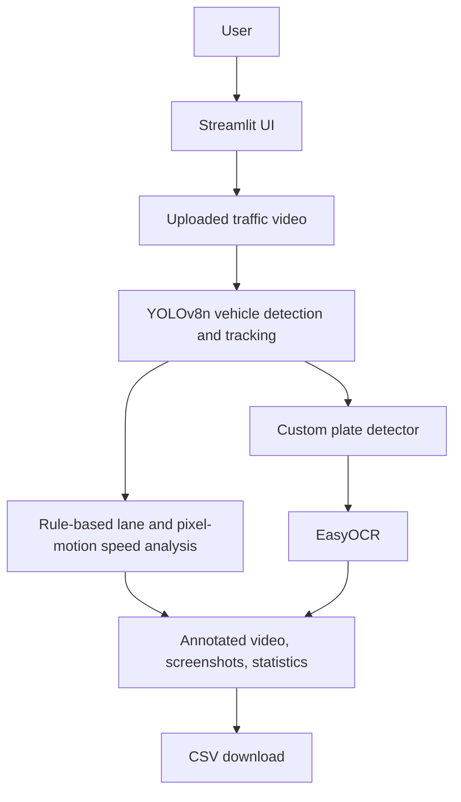

# System architecture

## Runtime flow

1. A user uploads a road-traffic video through Streamlit.
2. OpenCV reads the video frame by frame.
3. YOLOv8n detects supported COCO vehicle classes and Ultralytics tracking assigns IDs.
4. The application assigns a left/right side based on the frame centre and estimates uncalibrated motion from inter-frame pixel displacement.
5. Buses or trucks on the right side are labelled `Wrong Lane`; estimated speed above 60 is labelled `Over Speed`.
6. A custom detector finds plate regions and EasyOCR attempts transcription.
7. The interface presents live counts, annotated frames, saved crops, summary statistics, downloadable video, and CSV results.

## Storage

There is no database or external backend. Uploaded media and generated artifacts are stored in local runtime directories. These files are ephemeral on many cloud-hosting platforms.

## Important interpretation

The speed value is a pixel-motion heuristic, not a calibrated physical speed measurement. The left/right rule is not a general lane-understanding model. Results are therefore suitable for a research prototype, not automatic enforcement.

